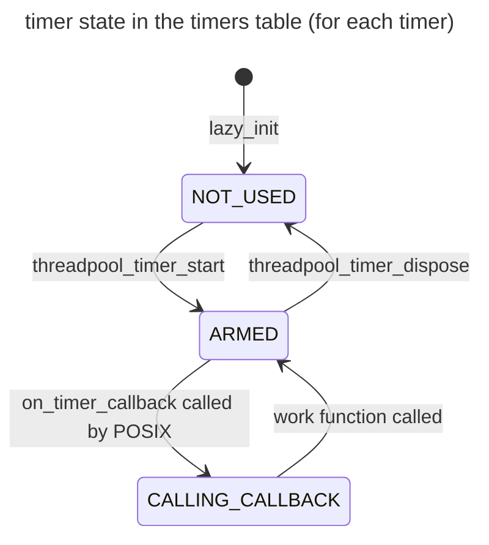

# threadpool_linux

## Overview

`threadpool_linux` is the Linux-specific implementation of the `threadpool` module. It receives an execution engine at creation time in order to executes scheduled asynchronous work items after been created. `threadpool_linux` supports timer functions to execute at a regular interval.

## Design

`threadpool_linux` provides the Linux implementation of the `threadpool` PAL API. The `threadpool` object starts a predefined number of threads that are used to execute the work items. The `threadpool` unit tracks all the work items which need to be executed in an task array. All incoming tasks are being added in `threadpool_schedule_work` and scheduled in `threadpool_work_func`.

`threadpool_linux` maintains the following:
1. `max_thread_count`, `min_thread_count`, `used_thread_count` : static 32-bit counters for the `threadpool` thread limits.
2. `semaphore` : a semaphore to ensure the number of waiting tasks changed atomically when a task is inserted or consumed in the array.
3. `task_queue` : a `TQUEUE` of waiting tasks with default size 2048, initialized in `threadpool_create`. Each array item contains a `THREADPOOL_TASK` object, which obtains the `task_state` and task function information.
8. `thread_handle_array` : an array of threads in the `threadpool`, all intialized in `threadpool_create`.

```
### Threadpool timer

The threadpool timer currently uses the POSIX timer implementation with the timer events generating a new thread (`SIGEV_THREAD`) when an event triggers.
When the event is triggered, it needs the timer instance to stay allocated until it is completed. POSIX makes no guarantees whether the in flight signals will still execute. Thus it can happen that after a delete of a timer, the timer callback is still executed.

In order to accomodate for this, the chosen design is to track the state of the timers (and their associated user callback function and context) in an internal table that is static. This ensures that regardless of when POSIX calls the callback supplied to the POSIX timer, the memory is available and it has not been freed.

Each timer tracked in the internal timer table has:
- a state (NOT_USED, ARMED, CALLING_CALLBACK)
- the work function and context
- epoch number (see below ABA problem details)



#### ABA problem

The timer implementation is susceptible to the ABA problem.

It could happen that a timer (T1) is started, taking one of the entries in the timer table to store its data.

If the timer T1 is disposed before the callback from POSIX is executed, the timer entry in the table is released.

Still before the POSIX callback is executed, let's assume another timer (T2) is started and it takes the same entry in the timers table.

At this point the original POSIX callback (that was supposed to fire for timer T1) fires and executes the callback recorded in the timers table, but that is the callback for T2, resulting in an unwanted spurious callback.

In order to avoid this problem an epoch number is to be used.
This epoch number is stamped in the timer table entry and also is passed to the POSIX timer APIs, so that it can be used for comparison in the POSIX timer callback.

This results in the need of storing 2 things in the sigval pointer that gets passed as context to the POSIX timer callback:
- the epoch number.
- a reference/index to the timer table entry.

The context has in normal circumstances 64 bits, thus we can share the 64 bits between the 2 fields.
Given that the expected number of timers to be used concurrently is not expected to be very high, we can reserve 10 bits (1024) for the index of the timer table entry, leaving the rest of the 54 bits for the epoch number.

Rules for the timer epoch number:
- Timer epoch number is initialized to 0 (static).
- Timer epoch number is incremented whenever a new timer is started and thus an entry in the timers table becomes used.
- Timer epoch number gets stamped in the entry in the timers table and gets passed to the POSIX timer function as context.
- Timer epoch number is checked in the POSOX timer callback in order to make sure that the timer work function is called for the correct timer.

## Exposed API

```C
typedef struct THREADPOOL_TAG THREADPOOL;
typedef struct THREADPOOL_WORK_ITEM_TAG THREADPOOL_WORK_ITEM;
typedef void (*THREADPOOL_WORK_FUNCTION)(void* context);

typedef struct THREADPOOL_TIMER_TAG THREADPOOL_TIMER;
THANDLE_TYPE_DECLARE(THREADPOOL_TIMER);

THANDLE_TYPE_DECLARE(THREADPOOL);
THANDLE_TYPE_DECLARE(THREADPOOL_WORK_ITEM);

MOCKABLE_FUNCTION(, THANDLE(THREADPOOL), threadpool_create, EXECUTION_ENGINE_HANDLE, execution_engine);

MOCKABLE_FUNCTION(, THANDLE(THREADPOOL_WORK_ITEM), threadpool_create_work_item, THANDLE(THREADPOOL), threadpool, THREADPOOL_WORK_FUNCTION, work_function, void*, work_function_context);

MOCKABLE_FUNCTION(, int, threadpool_schedule_work_item, THANDLE(THREADPOOL), threadpool, THANDLE(THREADPOOL_WORK_ITEM), threadpool_work_item);

MOCKABLE_FUNCTION(, int, threadpool_schedule_work, THANDLE(THREADPOOL), threadpool, THREADPOOL_WORK_FUNCTION, work_function, void*, work_function_context);

MOCKABLE_FUNCTION(, THANDLE(THREADPOOL_TIMER), threadpool_timer_start, THANDLE(THREADPOOL), threadpool, uint32_t, start_delay_ms, uint32_t, timer_period_ms, THREADPOOL_WORK_FUNCTION, work_function, void*, work_function_context);

MOCKABLE_FUNCTION(, int, threadpool_timer_restart, THANDLE(THREADPOOL_TIMER), timer, uint32_t, start_delay_ms, uint32_t, timer_period_ms);

MOCKABLE_FUNCTION(, void, threadpool_timer_cancel, THANDLE(THREADPOOL_TIMER), timer);
```

## Static functions

```c
static void on_timer_callback(sigval_t timer_data);
static int threadpool_work_func(void* param);
```

### threadpool_create

```C
MOCKABLE_FUNCTION(, THANDLE(THREADPOOL), threadpool_create, EXECUTION_ENGINE_HANDLE, execution_engine);
```

`threadpool_create` creates a new threadpool.

**SRS_THREADPOOL_LINUX_07_002: [** If `execution_engine` is `NULL`, `threadpool_create` shall fail and return `NULL`. **]**

**SRS_THREADPOOL_LINUX_07_001: [** `threadpool_create` shall allocate memory for a threadpool object and on success return a non-`NULL` handle to it. **]**

**SRS_THREADPOOL_LINUX_07_004: [** `threadpool_create` shall get the `min_thread_count` and `max_thread_count` thread parameters from the `execution_engine`. **]**

**SRS_THREADPOOL_LINUX_07_005: [** `threadpool_create` shall allocate memory for an array of thread handles of size `min_thread_count` and on success return a non-`NULL` handle to it. **]**

**SRS_THREADPOOL_LINUX_01_013: [** `threadpool_create` shall create a queue of threadpool work items by calling `TQUEUE_CREATE(THANDLE(THREADPOOL_WORK_ITEM))` with initial size 2048 and max size `UINT32_MAX`. **]**

**SRS_THREADPOOL_LINUX_07_008: [** `threadpool_create` shall create a SRW lock by calling `srw_lock_create`. **]**

**SRS_THREADPOOL_LINUX_07_009: [** `threadpool_create` shall create a shared semaphore with initialized value zero. **]**

**SRS_THREADPOOL_LINUX_07_020: [** `threadpool_create` shall create `min_thread_count` number of threads for `threadpool` using `ThreadAPI_Create`. **]**

**SRS_THREADPOOL_LINUX_07_022: [** If one of the thread creation fails, `threadpool_create` shall fail, terminate all threads already created and return `NULL`. **]**

**SRS_THREADPOOL_LINUX_07_011: [** If any error occurs, `threadpool_create` shall fail and return `NULL`. **]**

### threadpool_dispose

```C
static void threadpool_dispose(THREADPOOL* threadpool)
```

`threadpool_dispose` frees the resouces associated with threadpool.

**SRS_THREADPOOL_LINUX_07_089: [** `threadpool_dispose` shall signal all threads to return. **]**

**SRS_THREADPOOL_LINUX_07_027: [** `threadpool_dispose` shall join all threads in the `threadpool`. **]**

**SRS_THREADPOOL_LINUX_07_014: [** `threadpool_dispose` shall destroy the semphore by calling `sem_destroy`. **]**

**SRS_THREADPOOL_LINUX_07_015: [** `threadpool_dispose` shall destroy the SRW lock by calling `srw_lock_destroy`. **]**

**SRS_THREADPOOL_LINUX_07_016: [** `threadpool_dispose` shall free the memory allocated in `threadpool_create`. **]**


### threadpool_schedule_work

```C
MOCKABLE_FUNCTION(, int, threadpool_schedule_work, THANDLE(THREADPOOL), threadpool, THREADPOOL_WORK_FUNCTION, work_function, void*, work_function_context);
```

`threadpool_schedule_work` schedule the threadpool to work.

**SRS_THREADPOOL_LINUX_07_029: [** If `threadpool` is `NULL`, `threadpool_schedule_work` shall fail and return a non-zero value. **]**

**SRS_THREADPOOL_LINUX_07_030: [** If `work_function` is `NULL`, `threadpool_schedule_work` shall fail and return a non-zero value. **]**

**SRS_THREADPOOL_LINUX_07_033: [** `threadpool_schedule_work` shall acquire the SRW lock in shared mode by calling `srw_lock_acquire_shared`. **]**

**SRS_THREADPOOL_LINUX_07_034: [** `threadpool_schedule_work` shall increment the `insert_pos`. **]**

**SRS_THREADPOOL_LINUX_07_035: [** If task state is `TASK_NOT_USED`, `threadpool_schedule_work` shall set the current task state to `TASK_INITIALIZING`. **]**

**SRS_THREADPOOL_LINUX_07_036: [** Otherwise, `threadpool_schedule_work` shall release the shared SRW lock by calling `srw_lock_release_shared` and increase `task_array` capacity: **]**

- **SRS_THREADPOOL_LINUX_07_037: [** `threadpool_schedule_work` shall acquire the SRW lock in exclusive mode by calling `srw_lock_acquire_exclusive`. **]**

- **SRS_THREADPOOL_LINUX_07_038: [** `threadpool_schedule_work` shall get the current size of task array by calling `interlocked_add`. **]**

- **SRS_THREADPOOL_LINUX_07_039: [** If there is any overflow computing the new size, `threadpool_schedule_work` shall fail and return a non-zero value . **]**

- **SRS_THREADPOOL_LINUX_07_040: [** Otherwise, `threadpool_schedule_work` shall double the current task array size. **]**

- **SRS_THREADPOOL_LINUX_07_041: [** `threadpool_schedule_work` shall realloc the memory used for the array items. **]**

- **SRS_THREADPOOL_LINUX_07_042: [** If any error occurs, `threadpool_schedule_work` shall fail and return a non-zero value. **]**

- **SRS_THREADPOOL_LINUX_07_043: [** `threadpool_schedule_work` shall initialize every task item in the new task array with `task_func` and `task_param` set to `NULL` and `task_state` set to `TASK_NOT_USED`. **]**

- **SRS_THREADPOOL_LINUX_07_044: [** `threadpool_schedule_work` shall memmove everything between the consume index and the size of the array before resize to the end of the new resized array. **]**

- **SRS_THREADPOOL_LINUX_07_045: [** `threadpool_schedule_work` shall reset the `consume_idx` and `insert_idx` to 0 after resize the task array. **]**

- **SRS_THREADPOOL_LINUX_07_046: [** `threadpool_schedule_work` shall release the SRW lock by calling `srw_lock_release_exclusive`. **]**

**SRS_THREADPOOL_LINUX_07_048: [** If reallocating the task array fails, `threadpool_schedule_work` shall fail and return a non-zero value. **]**

**SRS_THREADPOOL_LINUX_07_049: [** `threadpool_schedule_work` shall copy the work function and work function context into insert position in the task array and assign `0` to the return variable to indicate success. **]**

**SRS_THREADPOOL_LINUX_07_050: [** `threadpool_schedule_work` shall set the `task_state` to `TASK_WAITING` and then release the shared SRW lock. **]**

**SRS_THREADPOOL_LINUX_07_051: [** `threadpool_schedule_work` shall unblock the `threadpool` semaphore by calling `sem_post`. **]**

**SRS_THREADPOOL_LINUX_07_047: [** `threadpool_schedule_work` shall return zero on success. **]**

### threadpool_timer_start

```C
MOCKABLE_FUNCTION(, THANDLE(THREADPOOL_TIMER), threadpool_timer_start, THANDLE(THREADPOOL), threadpool, uint32_t, start_delay_ms, uint32_t, timer_period_ms, THREADPOOL_WORK_FUNCTION, work_function, void*, work_function_ctx);
```

`threadpool_timer_start` starts a threadpool timer which runs after `start_delay_ms` milliseconds and then runs again every `timer_period_ms` milliseconds until `threadpool_timer_cancel` or `threadpool_timer_destroy` is called. The `timer_handle` must be stopped before closing/destroying the threadpool.

**SRS_THREADPOOL_LINUX_07_054: [** If `threadpool` is `NULL`, `threadpool_timer_start` shall fail and return NULL. **]**

**SRS_THREADPOOL_LINUX_07_055: [** If `work_function` is `NULL`, `threadpool_timer_start` shall fail and return NULL. **]**

**SRS_THREADPOOL_LINUX_07_058: [** `threadpool_timer_start` shall allocate memory for `THANDLE(THREADPOOL_TIMER)`, passing `threadpool_timer_dispose` as dispose function and store `work_function` and `work_function_ctx` in it. **]**

**SRS_THREADPOOL_LINUX_07_096: [** `threadpool_timer_start` shall call `lazy_init` with `do_init` as initialization function.  **]**

**SRS_THREADPOOL_LINUX_07_057: [** `work_function_ctx` shall be allowed to be `NULL`. **]**

**SRS_THREADPOOL_LINUX_01_002: [** `threadpool_timer_start` shall find an unused entry in the timers table maintained by the module. **]**

**SRS_THREADPOOL_LINUX_01_003: [** 1024 timers shall be supported. **]**

**SRS_THREADPOOL_LINUX_01_001: [** If all timer entries are used, `threadpool_timer_start` shall fail and return NULL. **]**

**SRS_THREADPOOL_LINUX_01_005: [** If an unused entry is found, it's state shall be marked as `ARMED`. **]**

**SRS_THREADPOOL_LINUX_01_011: [** `threadpool_timer_start` shall increment the timer epoch number and store it in the selected entry in the timer table. **]**

**SRS_THREADPOOL_LINUX_07_059: [** `threadpool_timer_start` shall call `timer_create` and `timer_settime` to schedule execution. **]**

**SRS_THREADPOOL_LINUX_07_060: [** If any error occurs, `threadpool_timer_start` shall fail and return NULL. **]**

**SRS_THREADPOOL_LINUX_07_062: [** `threadpool_timer_start` shall succeed and return a non-NULL handle. **]**

**SRS_THREADPOOL_LINUX_07_063: [** If `timer_settime` fails, `threadpool_timer_start` shall delete the timer by calling `timer_delete`. **]**

### do_init
```C
static int do_init(void* params);
```

`do_init` initializes the state tracked for each of the timers in the timers table.

**SRS_THREADPOOL_LINUX_01_004: [** `do_init` shall initialize the state for each timer to `NOT_USED`. **]**

**SRS_THREADPOOL_LINUX_07_099: [** `do_init` shall succeed and return 0. **]**

### threadpool_timer_restart

```C
MOCKABLE_FUNCTION(, int, threadpool_timer_restart, THANDLE(THREADPOOL_TIMER), timer, uint32_t, start_delay_ms, uint32_t, timer_period_ms);
```

`threadpool_timer_restart` changes the delay and period of an existing timer.

**SRS_THREADPOOL_LINUX_07_064: [** If `timer` is `NULL`, `threadpool_timer_restart` shall fail and return a non-zero value. **]**

**SRS_THREADPOOL_LINUX_07_065: [** `threadpool_timer_restart` shall call `timer_settime` to change the delay and period. **]**

**SRS_THREADPOOL_LINUX_07_066: [** If `timer_settime` fails, `threadpool_timer_restart` shall fail and return a non-zero value. **]**

**SRS_THREADPOOL_LINUX_07_067: [** `threadpool_timer_restart` shall succeed and return 0. **]**

### threadpool_timer_cancel

```C
MOCKABLE_FUNCTION(, void, THANDLE(THREADPOOL_TIMER), THREADPOOL_TIMER *, timer);
```

`threadpool_timer_cancel` shall stops the timer. Afterward, the timer may be resumed with a new time by calling `threadpool_timer_restart` or cleaned up by calling `threadpool_timer_destroy`.

**SRS_THREADPOOL_LINUX_07_068: [** If `timer` is `NULL`, `threadpool_timer_cancel` shall fail and return. **]**

**SRS_THREADPOOL_LINUX_07_069: [** `threadpool_timer_cancel` shall call `timer_settime` with 0 for `flags` and `NULL` for `old_value` and `{0}` for `new_value` to cancel the ongoing timers. **]**

### threadpool_timer_dispose

```C
static void threadpool_timer_dispose(THREADPOOL_TIMER * timer);
```

`threadpool_timer_destroy` stops the timer started by `threadpool_timer_start` and cleans up its resources.

**SRS_THREADPOOL_LINUX_07_071: [** `threadpool_timer_dispose` shall call `timer_delete` to destroy the ongoing timers. **]**

**SRS_THREADPOOL_LINUX_01_006: [** If the timer state is `ARMED`, `threadpool_timer_dispose` shall set the state of the timer to `NOT_USED`. **]**

**SRS_THREADPOOL_LINUX_01_010: [** Otherwise, `threadpool_timer_dispose` shall block until the state is `ARMED` and reattempt to set the state to `NOT_USED`. **]**

### static void on_timer_callback(sigval_t timer_data);

```C
static void on_timer_callback(sigval_t timer_data);
```

`on_timer_callback` executes when the POSIX timer is triggered.

**SRS_THREADPOOL_LINUX_45_002: [** `on_timer_callback` shall extract from the lower 10 bits of `timer_data.sival_ptr` the information indicating which timer table entry is being triggered. **]**

**SRS_THREADPOOL_LINUX_01_012: [** `on_timer_callback` shall use the rest of the higher bits of `timer_data.sival_ptr` as timer epoch. **]**

**SRS_THREADPOOL_LINUX_01_008: [** If the timer is in the state `ARMED`: **]**

- **SRS_THREADPOOL_LINUX_01_007: [** `on_timer_callback` shall transition it to `CALLING_CALLBACK`. **]**

- **SRS_THREADPOOL_LINUX_45_004: [** If the timer epoch of the timer table entry is the same like the timer epoch in `timer_data.sival_ptr`, `on_timer_callback` shall call the timer's `work_function` with `work_function_ctx`. **]**

- **SRS_THREADPOOL_LINUX_01_009: [** `on_timer_callback` shall transition it to `ARMED`. **]**

### threadpool_work_func

```C
static int threadpool_work_func(void* param);
```

`threadpool_work_func` executes work items for as long as it can acquire work items from the threadpool's task array.

**SRS_THREADPOOL_LINUX_07_073: [** If `param` is `NULL`, `threadpool_work_func` shall fail and return. **]**

**SRS_THREADPOOL_LINUX_07_074: [** `threadpool_work_func` shall get the real time by calling `clock_gettime` to set the waiting time for semaphore. **]**

**SRS_THREADPOOL_LINUX_07_088: [** If `clock_gettime` fails, `threadpool_work_func` shall run the loop again. **]**

**SRS_THREADPOOL_LINUX_07_075: [** `threadpool_work_func` shall wait on the semaphore with a time limit. **]**

**SRS_THREADPOOL_LINUX_07_087: [** If `sem_timedwait` fails, `threadpool_work_func` shall timeout and run the loop again. **]**

**SRS_THREADPOOL_LINUX_07_076: [** `threadpool_work_func` shall acquire the shared SRW lock by calling `srw_lock_acquire_shared`. **]**

**SRS_THREADPOOL_LINUX_07_077: [** `threadpool_work_func` shall get the current task array size by calling `interlocked_add`. **]**

**SRS_THREADPOOL_LINUX_07_078: [** `threadpool_work_func` shall increment the current consume index by calling `interlocked_increment_64`. **]**

**SRS_THREADPOOL_LINUX_07_079: [** `threadpool_work_func` shall get the next waiting task consume index from incremented consume index modulo current task array size. **]**

**SRS_THREADPOOL_LINUX_07_080: [** If consume index has task state `TASK_WAITING`, `threadpool_work_func` shall set the task state to `TASK_WORKING`. **]**

**SRS_THREADPOOL_LINUX_07_081: [** `threadpool_work_func` shall copy the function and parameter to local variables. **]**

**SRS_THREADPOOL_LINUX_07_082: [** `threadpool_work_func` shall set the task state to `TASK_NOT_USED`. **]**

**SRS_THREADPOOL_LINUX_07_083: [** `threadpool_work_func` shall release the shared SRW lock by calling `srw_lock_release_shared`. **]**

**SRS_THREADPOOL_LINUX_07_084: [** If the work item function is not `NULL`, `threadpool_work_func` shall execute it with `work_function_ctx`. **]**

**SRS_THREADPOOL_LINUX_07_085: [** `threadpool_work_func` shall loop until the flag to stop the threads is not set to 1. **]**

### threadpool_create_work_item

```c
MOCKABLE_FUNCTION(, THANDLE(THREADPOOL_WORK_ITEM), threadpool_create_work_item, THANDLE(THREADPOOL), threadpool, THREADPOOL_WORK_FUNCTION, work_function, void*, work_function_context);
```

`threadpool_create_work_item` creates a work item to be executed by the threadpool.

**SRS_THREADPOOL_LINUX_05_001: [** If `threadpool` is `NULL`, `threadpool_create_work_item` shall fail and return a `NULL` value. **]**

**SRS_THREADPOOL_LINUX_05_002: [** If `work_function` is `NULL`, `threadpool_create_work_item` shall fail and return a `NULL` value. **]**

**SRS_THREADPOOL_LINUX_05_005: [** `threadpool_create_work_item` shall allocate memory for `threadpool_work_item` of type `THANDLE(THREADPOOL_WORK_ITEM)`. **]**

**SRS_THREADPOOL_LINUX_05_006: [** If during the initialization of `threadpool_work_item`, `malloc` fails then `threadpool_create_work_item` shall fail and return a `NULL` value. **]**

**SRS_THREADPOOL_LINUX_05_007: [** `threadpool_create_work_item` shall copy the `work_function` and `work_function_context` into the threadpool work item. **]**

### threadpool_schedule_work_item

```c
MOCKABLE_FUNCTION(, int, threadpool_schedule_work_item, THANDLE(THREADPOOL), threadpool, THANDLE(THREADPOOL_WORK_ITEM), threadpool_work_item);
```

`threadpool_schedule_work_item` schedules a work item to be executed by the threadpool.

**SRS_THREADPOOL_LINUX_05_010: [** If `threadpool` is `NULL`, `threadpool_schedule_work_item` shall fail and return a non-zero value. **]**

**SRS_THREADPOOL_LINUX_05_011: [** If `threadpool_work_item` is `NULL`,  `threadpool_schedule_work_item` shall fail and set the return variable with a non-zero value. **]**

**SRS_THREADPOOL_LINUX_05_014: [** `threadpool_schedule_work_item` shall acquire the `SRW lock` in shared mode by calling `srw_lock_acquire_shared`. **]**

**SRS_THREADPOOL_LINUX_05_015: [** `threadpool_schedule_work_item` shall increment the `insert_pos`. **]**

**SRS_THREADPOOL_LINUX_05_016: [** If task state is `TASK_NOT_USED`, `threadpool_schedule_work_item` shall set the current task state to `TASK_INITIALIZING`. **]**

**SRS_THREADPOOL_LINUX_05_017: [** `threadpool_schedule_work_item` shall release the shared SRW lock by calling `srw_lock_release_shared` **]**

**SRS_THREADPOOL_LINUX_05_018: [** If the previous task state is not `TASK_NOT_USED` then `threadpool_schedule_work_item` shall increase `task_array` capacity **]**

- **SRS_THREADPOOL_LINUX_05_019: [** If reallocating the task array fails, `threadpool_schedule_work_item` shall fail and return a non-zero value. **]**

- **SRS_THREADPOOL_LINUX_05_020: [** Otherwise, `threadpool_schedule_work_item` shall acquire the SRW lock in shared mode by calling srw_lock_acquire_exclusive. **]**

- **SRS_THREADPOOL_LINUX_05_022: [** `threadpool_schedule_work_item` shall copy the `work_function` and `work_function_context` from `threadpool_work_item` into insert position in the task array. **]**

- **SRS_THREADPOOL_LINUX_05_023: [** `threadpool_schedule_work_item` shall set the `task_state` to `TASK_WAITING` and then release the shared SRW lock by calling srw_lock_release_exclusive. **]**

- **SRS_THREADPOOL_LINUX_05_025: [** `threadpool_schedule_work_item` shall unblock the `threadpool` semaphore by calling `sem_post`. **]**

- **SRS_THREADPOOL_LINUX_05_026: [** `threadpool_schedule_work_item` shall succeed and return 0. **]**