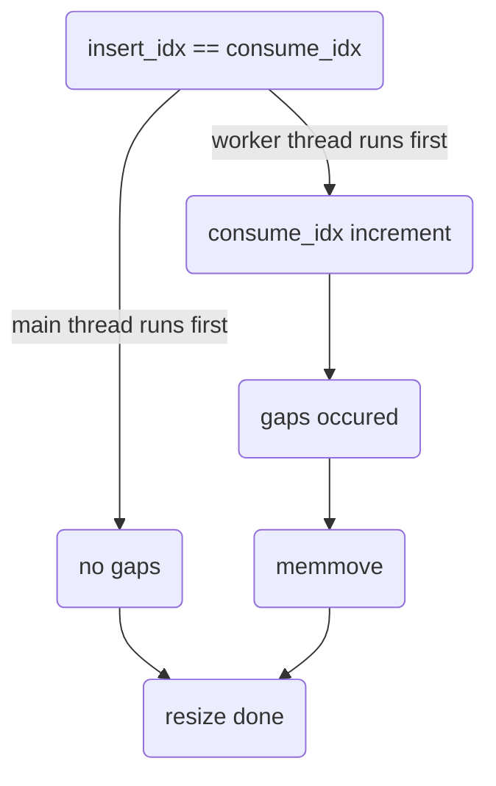

# threadpool_linux

## Overview

`threadpool_linux` is the Linux-specific implementation of the `threadpool` module.

## Design

`threadpool_linux` provides the Linux implementation of `threadpool`. The `threadpool` object contains an array of threads all initialized in `threadpool_open_async`  and an array of tasks all initialized in `threadpool_create`, all incoming tasks are being added in `threadpool_schedule_work` and scheduled in `threadpool_work_func`. 

`threadpool` maintains the following states:
1. `state`: a 32-bit variable represents a state enum value, which contains: 
    - `THREADPOOL_STATE_NOT_OPEN` : entered after a call to `threadpool_create` or a call to `internal_close`.
    - `THREADPOOL_STATE_OPENING` : entered in the beginning of a call to `threadpool_open_async`.
    - `THREADPOOL_STATE_OPEN` : entered after the call to `threadpool_open_async`.
    - `THREADPOOL_STATE_CLOSING` : entered in the beginning of a call to `internal_close`.
2. `max_thread_count`, `min_thread_count`, `used_thread_count` : a 32-bit counters for the `threadpool`.
3. `semaphore` : a semaphore to ensure the number of waiting tasks changed automically when a task is inserted or consumed in the array.
4. `task_array` : a circular array of waiting tasks with default size 2048, initialized in `threadpool_create`. Each array item contains a `THREADPOOL_TASK` object, which obtains the `task_state` and task function information.
    - `task_state` can be following:
       - `TASK_NOT_USED` : entered after a call to `threadpool_create`, new array items after a call to `reallocate_threadpool_array`, and a call to `threadpool_work_func`.
       - `TASK_INITIALIZING` : entered in the progress of a call to `threadpool_schedule_work`.
       - `TASK_WAITING` : entered after a call to `threadpool_schedule_work` with a zero return value.
       - `TASK_WORKING` : entered in the progress of a call to `threadpool_work_func` by calling `threadpool_open_async`.
5. `task_array_size` : a 32 bit variable represents the size of the task array.
6. `insert_idx` : a 64 bit variable represents the next available insert position in the circular task array.
7. `consume_idx` : a 64 bit variable represents the next available consume position in the circular task array.
8. `pending_call_context` : a 64 bit variable represents the tasks waiting to be scheduled. The value is initialized to be 0 in `threadpool_create`, incremented when a new task is inserting into the task array in `threadpool_schedule_work`, and decremented after the task has been scheduled.
9. `srw_lock` : a SRW lock to ensure the progress of resize array will not be interupted as well as task array insert and consume get locked when task array resize happens. 
10. `thread_handle_array` : an array of threads in the `threadpool`, all intialized in `threadpool_open_async`. 

### Reallocating the Task Array

When there are no unused slots in the circular task array, the task array size is doubled by calling `reallocate_threadpool_array`. New task array memory layout should be in same order of the original array with emilinated gaps between items.  `compress_count` is used to record the number of gaps between `insert_idx` and `consume_idx`. New task array should initialize `consume_idx` as -1 and `insert_idx` as (original array size - gap size - 1) to get the correct index when incremented. If the doubled array size get overflowed for a 32 bits integer, resize failed and return. In this case, the maximum size of task array is 2^32 and the maximum value of `insert_idx` and `consume_idx` is 2^64 which will never get overflowed.



## Exposed API
```C

typedef struct THREADPOOL_TAG* THREADPOOL_HANDLE;
typedef struct TIMER_INSTANCE_TAG* TIMER_INSTANCE_HANDLE;

#define THREADPOOL_OPEN_RESULT_VALUES \
    THREADPOOL_OPEN_OK, \
    THREADPOOL_OPEN_ERROR

MU_DEFINE_ENUM(THREADPOOL_OPEN_RESULT, THREADPOOL_OPEN_RESULT_VALUES)

typedef void (*ON_THREADPOOL_OPEN_COMPLETE)(void* context, THREADPOOL_OPEN_RESULT open_result);
typedef void (*THREADPOOL_WORK_FUNCTION)(void* context);

MOCKABLE_FUNCTION(, THREADPOOL_HANDLE, threadpool_create, EXECUTION_ENGINE_HANDLE, execution_engine);
MOCKABLE_FUNCTION(, void, threadpool_destroy, THREADPOOL_HANDLE, threadpool);

MOCKABLE_FUNCTION(, int, threadpool_open_async, THREADPOOL_HANDLE, threadpool, ON_THREADPOOL_OPEN_COMPLETE, on_open_complete, void*, on_open_complete_context);
MOCKABLE_FUNCTION(, void, threadpool_close, THREADPOOL_HANDLE, threadpool);

MOCKABLE_FUNCTION(, int, threadpool_schedule_work, THREADPOOL_HANDLE, threadpool, THREADPOOL_WORK_FUNCTION, work_function, void*, work_function_context);

MOCKABLE_FUNCTION(, int, threadpool_timer_start, THREADPOOL_HANDLE, threadpool, uint32_t, start_delay_ms, uint32_t, timer_period_ms, THREADPOOL_WORK_FUNCTION, work_function, void*, work_function_context, TIMER_INSTANCE_HANDLE*, timer_handle);

MOCKABLE_FUNCTION(, int, threadpool_timer_restart, TIMER_INSTANCE_HANDLE, timer, uint32_t, start_delay_ms, uint32_t, timer_period_ms);

MOCKABLE_FUNCTION(, void, threadpool_timer_cancel, TIMER_INSTANCE_HANDLE, timer);

MOCKABLE_FUNCTION(, void, threadpool_timer_destroy, TIMER_INSTANCE_HANDLE, timer);

```
###  threadpool_create

```C
MOCKABLE_FUNCTION(, THREADPOOL_HANDLE, threadpool_create, EXECUTION_ENGINE_HANDLE, execution_engine);
```

`threadpool_create` creates a new threadpool.

`threadpool_create` shall allocate memory for a threadpool object and on success return a non-NULL handle to it. 

If `execution_engine` is `NULL`, `threadpool_create` shall fail and return `NULL`. 

`threadpool_create` shall initialize thread count parameters by calling `execution_engine_linux_get_parameters` with parameter `execution_engine`. 

`threadpool_create` shall allocate memory for an array of thread objects and on success return a non-NULL handle to it.

`threadpool_create` shall allocate memory for an array of tasks and on success return a non-NULL handle to it.

`threadpool_create` shall initialize every task item in the tasks array with `task_func` and `task_param` set to `NULL` and `task_state` set to `TASK_NOT_USED`.

`threadpool_create` shall create a shared semaphore between threads with initialized value zero.

`threadpool_create` shall initilize the `state` to `THREADPOOL_STATE_NOT_OPEN`.

`insert_idx`  and `consume_idx` shall be intialzied to -1 to make the first increment start at zero.

If any error occurs, `threadpool_create` shall fail and return `NULL`.

### threadpool_destroy

```C
MOCKABLE_FUNCTION(, void, threadpool_destroy, THREADPOOL_HANDLE, threadpool);
```

`threadpool_destroy` frees the resouces associated with `threadpool`.

If `threadpool` is `NULL`, `threadpool_destroy` shall return.

`threadpool_destroy` shall implicit close if `threadpool` state is set to `THREADPOOL_STATE_OPEN`. 

`threadpool_destroy` shall free the resources associated with the threadpool handle. 

`threadpool_destroy` shall destroy the semphore by calling `sem_destroy`.

`threadpool_destroy` shall destroy the SRW lock by calling `srw_lock_destroy`.

### threadpool_open_async

```C
MOCKABLE_FUNCTION(, int, threadpool_open_async, THREADPOOL_HANDLE, threadpool, ON_THREADPOOL_OPEN_COMPLETE, on_open_complete, void*, on_open_complete_context);
```

`threadpool_open_async` opens the threadpool asynchronously.

If `threadpool` is `NULL`, `threadpool_open_async` shall fail and return a non-zero value. 

`threadpool_open_async` shall set the state to `THREADPOOL_STATE_OPENING`. 

If `threadpool` has already been opened, `threadpool_open_async` shall fail and return a non-zero value.

`threadpool_open_async` shall create the threads for `threadpool` using `ThreadAPI_Create`.

If one of the thread creation fails, `threadpool_open_async` shall fail and return a non-zero value, terminate all threads already created, indicate an error to the user by calling the `on_open_complete` callback with `THREADPOOL_OPEN_ERROR` and set `threadpool` state to `THREADPOOL_STATE_NOT_OPEN`.

Otherwise, `threadpool_open_async` shall set the state to `THREADPOOL_STATE_OPEN`, indicate open success to the user by calling the `on_open_complete` callback with `THREADPOOL_OPEN_OK` and return zero.

### threadpool_close

```C
MOCKABLE_FUNCTION(, void, threadpool_close, THREADPOOL_HANDLE, threadpool);
```

`threadpool_close` closes the threadpool.

If `threadpool` is `NULL`, `threadpool_close` shall fail and return.

Otherwise, `threadpool_close` shall terminate all threads in the `threadpool` and set the state to `THREADPOOL_STATE_NOT_OPEN`.

### threadpool_schedule_work

```C
MOCKABLE_FUNCTION(, int, threadpool_schedule_work, THREADPOOL_HANDLE, threadpool, THREADPOOL_WORK_FUNCTION, work_function, void*, work_function_context);
```

`threadpool_schedule_work` schedule the threadpool to work.

If `threadpool` is `NULL`, `threadpool_schedule_work` shall fail and return a non-zero value.

If `work_function` is `NULL`, `threadpool_schedule_work` shall fail and return a non-zero value.

`threadpool_schedule_work` shall get the threadpool state by calling `interlocked_add`.

`threadpool_schedule_work` shall validate that it's state is THREADPOOL_STATE_OPEN and if not shall fail and return a non-zero value.

`threadpool_schedule_work` shall increment the count of pending call that are in progress to be executed.

`threadpool_schedule_work` shall acquire the shared SRW lock by calling `srw_lock_acquire_shared`.

`threadpool_schedule_work` shall increment the `insert_pos` by one.

`threadpool_schedule_work` shall set the current task state to `TASK_INITIALIZING`.

If task has been already initialized, `threadpool_schedule_work` shall release the shared SRW lock by calling `srw_lock_release_shared` and increase `task_array` capacity by calling `reallocate_threadpool_array`.

  - If reallcate task array fails, `threadpool_schedule_work` shall fail and return a non-zero value.

`threadpool_schedule_work` shall obtain task information in next available task array index and return zero on success.

`threadpool_schedule_work` shall set the `task_state` to `TASK_WAITING` and then release the shared SRW lock.

`threadpool_schedule_work` shall unblock the `threadpool` semaphore by calling `sem_post`.

`threadpool_schedule_work` shall decrement the count of pending call that are in progress to be executed.

### threadpool_timer_start

`threadpool_timer_start` shall return zero on success. To be implemented.

### threadpool_timer_restart

`threadpool_timer_restart` shall return zero on success. To be implemented.

### threadpool_timer_cancel

`threadpool_timer_cancel` shall stops the timer and waiting for pending callbacks. To be implemented.

### threadpool_timer_destroy

`threadpool_timer_destroy` stops the timer and frees the resources associate with it. To be implemented. 

### threadpool_work_func

```C
static int threadpool_work_func(void* param);
```

`threadpool_work_func` shall obtain a work function.

If `param` is `NULL`, `threadpool_work_func` shall fail and return.

`threadpool_work_func` shall get the real time by calling `clock_gettime`.

`threadpool_work_func` shall  shall wait on the semaphore with a time limit of 2 seconds.

`threadpool_work_func` shall acquire the shared SRW lock by calling `srw_lock_acquire_shared`.

`threadpool_work_func` shall get the current task array size and next waiting task consume index.

If consume index has task state `TASK_WAITING`, `threadpool_work_func` shall set the task state to `TASK_WORKING`.

`threadpool_work_func` shall initialize `task_func` and `task_param` and then set the task state to `TASK_NOT_USED`.

`threadpool_work_func` shall release the shared SRW lock by calling `srw_lock_release_shared`.

If `task_param` is not `NULL`, `threadpool_work_func` shall execute it with parameter `task_param`.

### reallocate_threadpool_array

```C
static int reallocate_threadpool_array(THREADPOOL* threadpool);
```

`reallocate_threadpool_array` resize the task array size by doubling it.

`reallocate_threadpool_array` shall acquire the SRW lock in exclusive mode by calling `srw_lock_acquire_exclusive`.

`reallocate_threadpool_array` shall get the current size of task array.

If the array size get overflowed after doubled, `reallocate_threadpool_array` shall fail and return a non-zero value .

Otherwise, `reallocate_threadpool_array` shall double the current task array size and return zero in success.

`reallocate_threadpool_array` shall realloc the memory used for the array items and on success return a non-NULL handle to it.

If any error occurs, `reallocate_threadpool_array` shall fail and return a non-zero value.

`reallocate_threadpool_array` shall initialize every task item in the new task array with `task_func` and `task_param` set to `NULL` and `task_state` set to `TASK_NOT_USED`.

`reallocate_threadpool_array` shall remove any gap in the task array.

`reallocate_threadpool_array` shall reset the `consume_idx` and `insert_idx` to -1 after resize the task array.

`reallocate_threadpool_array` shall release the SRW lock by calling `srw_lock_release_exclusive`.
