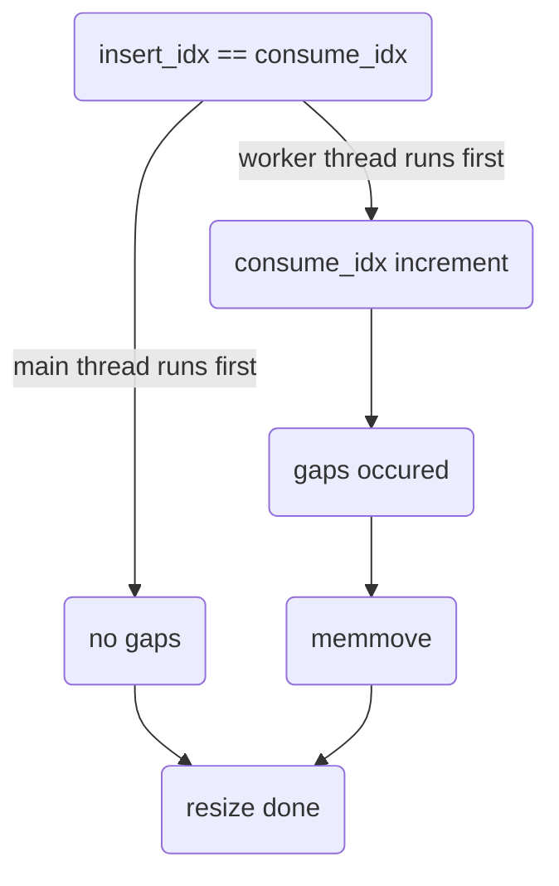
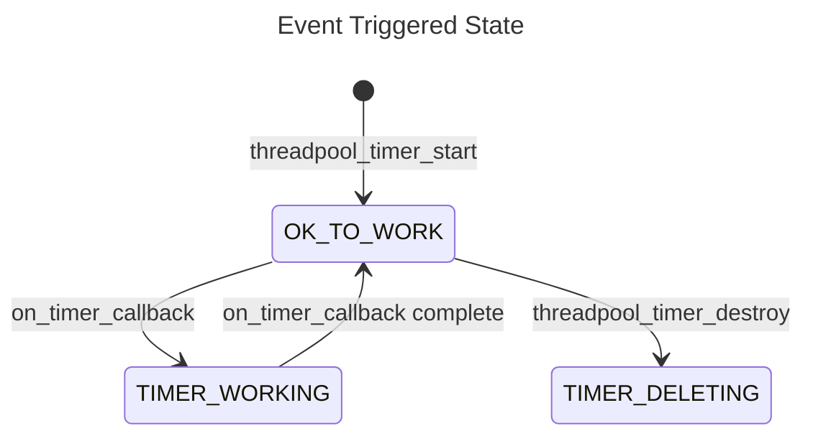

# threadpool_linux

## Overview

`threadpool_linux` is the Linux-specific implementation of the `threadpool` module. It receives an execution engine at creation time in order to executes scheduled asynchronous work items after been created. `threadpool_linux` supports timer functions to execute at a regular interval.

## Design

`threadpool_linux` provides the Linux implementation of the `threadpool` PAL API. The `threadpool` object starts a predefined number of threads that are used to execute the work items. The `threadpool` unit tracks all the work items which need to be executed in an task array. All incoming tasks are being added in `threadpool_schedule_work` and scheduled in `threadpool_work_func`.

`threadpool_linux` maintains the following:
1. `sm`: a SM handle to manage the state for `threadpool`.
2. `max_thread_count`, `min_thread_count`, `used_thread_count` : static 32-bit counters for the `threadpool` thread limits.
3. `semaphore` : a semaphore to ensure the number of waiting tasks changed atomically when a task is inserted or consumed in the array.
4. `task_array` : a circular array of waiting tasks with default size 2048, initialized in `threadpool_create`. Insert index and consume index for the array is initialized to 0. Insert index is incremented every time when a new work item add to the array, and the consume index is incremented every time when a task gets executed. The insert index modulo the array size gives the actual insert position, and the consume index modulo the array size gives the actual consume position. Each array item contains a `THREADPOOL_TASK` object, which obtains the `task_state` and task function information.
    - `task_state` can be following:
       - `TASK_NOT_USED` : Entry is not used. Entered after a call to `threadpool_create`, new array items after a call to `reallocate_threadpool_array`, and a call to `threadpool_work_func`.
       - `TASK_INITIALIZING` : Start copying work item into the entry. Entered in the progress of a call to `threadpool_schedule_work`.
       - `TASK_WAITING` : Work item in the entry is waiting to be executed. Entered after a call to `threadpool_schedule_work` with a zero return value.
       - `TASK_WORKING` : Work item is executing. Entered in the progress of a call to `threadpool_work_func` by calling `threadpool_open`.
5. `task_array_size` : a 32 bit variable represents the size of the task array.
6. `insert_idx` : a 64 bit variable represents the next available insert position in the circular task array.
7. `consume_idx` : a 64 bit variable represents the next available consume position in the circular task array.
8. `srw_lock` : a SRW lock to ensure the progress of resize array will not be interupted as well as task array insert and consume get locked when task array resize happens.
9. `thread_handle_array` : an array of threads in the `threadpool`, all intialized in `threadpool_open`.

### Reallocating the Task Array

`threadpool_linux` allocates an array for all tasks instead of allocating a context for each work item to reduce the overhead of memory allocation since this module is in the hot path. When the task array is full, the array size shall be doubled to reduce the number of memory allocations.

When reallocating the task array, there is overhead due to the memory allocation and copy. But the performance impact would be very infrequent since the size of array is doubled every time.

If there is a context switch right after getting the insert index and the consume index is incremented after that, there will be a gap between consume index and insert index during reallocation. In this case, the tasks between consume index to the end of the array before resize should be moved to the end of the new resized array.

New task array memory layout should be in same order of the original array except more empty slots is needed to make sure there is no trailing gaps in the new resized array.  `moving_count` is used to record the number of tasks between `consume_idx` and `task_array_size` before resize. New task array should initialize `consume_idx` as 0 and `insert_idx` as original array size if there's no gaps; `consume_idx` remains the same and `insert_idx` set to `new_array_size` - `move_count` if gaps exist.

If the doubled array size get overflowed for a 32 bits integer, resize failed and return. In this case, the maximum size of task array is 2^32 and the maximum value of `insert_idx` and `consume_idx` is 2^64 which will never get overflowed.


### Threadpool timer

The threadpool timer currently uses the POSIX timer implementation with the timer events generating a new thread (`SIGEV_THREAD`) when an event triggers.
When the event is triggered, it needs the timer instance to stay allocated until it is completed, so there is a guard to prevent the timer from being deleted while the timer is executing its work function.



Even with this guard in place, during `threadpool_timer_delete` there is a small window where an event was triggered just before and a thread is being created. 
The guard prevents any work from happening, but the event callback can still be called after the `timer_delete` call. A small wait before the free keeps the timer instance alive long enough for the callback to use it if we hit this window.

## Exposed API

```C
typedef struct THREADPOOL_TAG THREADPOOL;
typedef struct TIMER_INSTANCE_TAG* TIMER_INSTANCE_HANDLE;
typedef struct THREADPOOL_WORK_ITEM_TAG* THREADPOOL_WORK_ITEM_HANDLE;
typedef void (*THREADPOOL_WORK_FUNCTION)(void* context);

THANDLE_TYPE_DECLARE(THREADPOOL);

MOCKABLE_FUNCTION(, THANDLE(THREADPOOL), threadpool_create, EXECUTION_ENGINE_HANDLE, execution_engine);

MOCKABLE_FUNCTION(, int, threadpool_open, THANDLE(THREADPOOL), threadpool);
MOCKABLE_FUNCTION(, void, threadpool_close, THANDLE(THREADPOOL), threadpool);

MOCKABLE_FUNCTION(, THREADPOOL_WORK_ITEM_HANDLE, threadpool_create_work_item, THANDLE(THREADPOOL), threadpool, THREADPOOL_WORK_FUNCTION, work_function, void*, work_function_context);

MOCKABLE_FUNCTION(, int, threadpool_schedule_work_item, THANDLE(THREADPOOL), threadpool, THREADPOOL_WORK_ITEM_HANDLE, work_item_context);

MOCKABLE_FUNCTION(, void, threadpool_work_context_destroy, THREADPOOL_WORK_ITEM_HANDLE, work_item_context);

MOCKABLE_FUNCTION(, int, threadpool_schedule_work, THANDLE(THREADPOOL), threadpool, THREADPOOL_WORK_FUNCTION, work_function, void*, work_function_context);

MOCKABLE_FUNCTION(, int, threadpool_timer_start, THANDLE(THREADPOOL), threadpool, uint32_t, start_delay_ms, uint32_t, timer_period_ms, THREADPOOL_WORK_FUNCTION, work_function, void*, work_function_context, TIMER_INSTANCE_HANDLE*, timer_handle);

MOCKABLE_FUNCTION(, int, threadpool_timer_restart, TIMER_INSTANCE_HANDLE, timer, uint32_t, start_delay_ms, uint32_t, timer_period_ms);

MOCKABLE_FUNCTION(, void, threadpool_timer_cancel, TIMER_INSTANCE_HANDLE, timer);

MOCKABLE_FUNCTION(, void, threadpool_timer_destroy, TIMER_INSTANCE_HANDLE, timer);
```

## Static functions

```c
static void on_timer_callback(sigval_t timer_data);
static int threadpool_work_func(void* param);
```

### threadpool_create

```C
MOCKABLE_FUNCTION(, THANDLE(THREADPOOL), threadpool_create, EXECUTION_ENGINE_HANDLE, execution_engine);
```

`threadpool_create` creates a new threadpool.

**SRS_THREADPOOL_LINUX_07_001: [** `threadpool_create` shall allocate memory for a threadpool object and on success return a non-`NULL` handle to it. **]**

**SRS_THREADPOOL_LINUX_07_002: [** If `execution_engine` is `NULL`, `threadpool_create` shall fail and return `NULL`. **]**

**SRS_THREADPOOL_LINUX_07_003: [** `threadpool_create` shall create a `SM_HANDLE` by calling `sm_create`. **]**

**SRS_THREADPOOL_LINUX_07_004: [** `threadpool_create` shall get the `min_thread_count` and `max_thread_count` thread parameters from the `execution_engine`. **]**

**SRS_THREADPOOL_LINUX_07_005: [** `threadpool_create` shall allocate memory for an array of thread handles of size `min_thread_count` and on success return a non-`NULL` handle to it. **]**

**SRS_THREADPOOL_LINUX_07_006: [** `threadpool_create` shall allocate memory with default task array size 2048 for an array of tasks and on success return a non-`NULL` handle to it. **]**

**SRS_THREADPOOL_LINUX_07_007: [** `threadpool_create` shall initialize every task item in the tasks array with `task_func` and `task_param` set to `NULL` and `task_state` set to `TASK_NOT_USED`. **]**

**SRS_THREADPOOL_LINUX_07_008: [** `threadpool_create` shall create a SRW lock by calling `srw_lock_create`. **]**

**SRS_THREADPOOL_LINUX_07_009: [** `threadpool_create` shall create a shared semaphore with initialized value zero. **]**

**SRS_THREADPOOL_LINUX_07_010: [** `insert_idx` and `consume_idx` for the task array shall be initialized to 0. **]**

**SRS_THREADPOOL_LINUX_07_011: [** If any error occurs, `threadpool_create` shall fail and return `NULL`. **]**

### threadpool_dispose

```C
static void threadpool_dispose(THREADPOOL* threadpool)
```

`threadpool_dispose` frees the resouces associated with `threadpool`.

**SRS_THREADPOOL_LINUX_07_013: [** `threadpool_destroy` shall perform an implicit close if `threadpool` is open. **]**

**SRS_THREADPOOL_LINUX_07_014: [** `threadpool_destroy` shall destroy the semphore by calling `sem_destroy`. **]**

**SRS_THREADPOOL_LINUX_07_015: [** `threadpool_destroy` shall destroy the SRW lock by calling `srw_lock_destroy`. **]**

**SRS_THREADPOOL_LINUX_07_016: [** `threadpool_destroy` shall free the memory allocated in `threadpool_create`. **]**

### threadpool_open

```C
MOCKABLE_FUNCTION(, int, threadpool_open, THANDLE(THREADPOOL), threadpool);
```

`threadpool_open` opens the threadpool.

**SRS_THREADPOOL_LINUX_07_017: [** If `threadpool` is `NULL`, `threadpool_open` shall fail and return a non-zero value. **]**

**SRS_THREADPOOL_LINUX_07_018: [** `threadpool_open` shall call `sm_open_begin`. **]**

**SRS_THREADPOOL_LINUX_07_019: [** If `sm_open_begin` indicates the open cannot be performed, `threadpool_open` shall fail and return a non-zero value. **]**

**SRS_THREADPOOL_LINUX_11_001: [** `threadpool_open` shall initialize internal threapool data items **]**

**SRS_THREADPOOL_LINUX_07_020: [** `threadpool_open` shall create number of `min_thread_count` threads for `threadpool` using `ThreadAPI_Create`. **]**

**SRS_THREADPOOL_LINUX_07_021: [** If any error occurs, `threadpool_open` shall fail and return a non-zero value. **]**

**SRS_THREADPOOL_LINUX_07_022: [** If one of the thread creation fails, `threadpool_open` shall fail and return a non-zero value, terminate all threads already created. **]**

**SRS_THREADPOOL_LINUX_07_023: [** Otherwise, `threadpool_open` shall shall call `sm_open_end` with true for success. **]**

**SRS_THREADPOOL_LINUX_07_024: [** `threadpool_open` shall return zero. **]**

### threadpool_close

```C
MOCKABLE_FUNCTION(, void, threadpool_close, THANDLE(THREADPOOL), threadpool);
```

`threadpool_close` closes the threadpool.

**SRS_THREADPOOL_LINUX_07_025: [** If `threadpool` is `NULL`, `threadpool_close` shall fail and return. **]**

**SRS_THREADPOOL_LINUX_07_026: [** Otherwise, `threadpool_close` shall call `sm_close_begin`. **]**

**SRS_THREADPOOL_LINUX_07_089: [** `threadpool_close` shall signal all threads `threadpool` is closing by calling `InterlockedHL_SetAndWakeAll`.  **]**

**SRS_THREADPOOL_LINUX_07_027: [** `threadpool_close` shall join all threads in the `threadpool`. **]**

**SRS_THREADPOOL_LINUX_07_028: [** `threadpool_close` shall call `sm_close_end`. **]**

### threadpool_schedule_work

```C
MOCKABLE_FUNCTION(, int, threadpool_schedule_work, THANDLE(THREADPOOL), threadpool, THREADPOOL_WORK_FUNCTION, work_function, void*, work_function_context);
```

`threadpool_schedule_work` schedule the threadpool to work.

**SRS_THREADPOOL_LINUX_07_029: [** If `threadpool` is `NULL`, `threadpool_schedule_work` shall fail and return a non-zero value. **]**

**SRS_THREADPOOL_LINUX_07_030: [** If `work_function` is `NULL`, `threadpool_schedule_work` shall fail and return a non-zero value. **]**

**SRS_THREADPOOL_LINUX_07_031: [** `threadpool_schedule_work` shall call `sm_exec_begin`. **]**

**SRS_THREADPOOL_LINUX_07_032: [** If `sm_exec_begin` returns `SM_EXEC_REFUSED`, `threadpool_schedule_work` shall fail and return a non-zero value. **]**

**SRS_THREADPOOL_LINUX_07_033: [** `threadpool_schedule_work` shall acquire the SRW lock in shared mode by calling `srw_lock_acquire_shared`. **]**

**SRS_THREADPOOL_LINUX_07_034: [** `threadpool_schedule_work` shall increment the `insert_pos`. **]**

**SRS_THREADPOOL_LINUX_07_035: [** If task state is `TASK_NOT_USED`, `threadpool_schedule_work` shall set the current task state to `TASK_INITIALIZING`. **]**

**SRS_THREADPOOL_LINUX_07_036: [** Otherwise, `threadpool_schedule_work` shall release the shared SRW lock by calling `srw_lock_release_shared` and increase `task_array` capacity: **]**

- **SRS_THREADPOOL_LINUX_07_037: [** `threadpool_schedule_work` shall acquire the SRW lock in exclusive mode by calling `srw_lock_acquire_exclusive`. **]**

- **SRS_THREADPOOL_LINUX_07_038: [** `threadpool_schedule_work` shall get the current size of task array by calling `interlocked_add`. **]**

- **SRS_THREADPOOL_LINUX_07_039: [** If there is any overflow computing the new size, `threadpool_schedule_work` shall fail and return a non-zero value . **]**

- **SRS_THREADPOOL_LINUX_07_040: [** Otherwise, `threadpool_schedule_work` shall double the current task array size. **]**

- **SRS_THREADPOOL_LINUX_07_041: [** `threadpool_schedule_work` shall realloc the memory used for the array items. **]**

- **SRS_THREADPOOL_LINUX_07_042: [** If any error occurs, `threadpool_schedule_work` shall fail and return a non-zero value. **]**

- **SRS_THREADPOOL_LINUX_07_043: [** `threadpool_schedule_work` shall initialize every task item in the new task array with `task_func` and `task_param` set to `NULL` and `task_state` set to `TASK_NOT_USED`. **]**

- **SRS_THREADPOOL_LINUX_07_044: [** `threadpool_schedule_work` shall memmove everything between the consume index and the size of the array before resize to the end of the new resized array. **]**

- **SRS_THREADPOOL_LINUX_07_045: [** `threadpool_schedule_work` shall reset the `consume_idx` and `insert_idx` to 0 after resize the task array. **]**

- **SRS_THREADPOOL_LINUX_07_046: [** `threadpool_schedule_work` shall release the SRW lock by calling `srw_lock_release_exclusive`. **]**

**SRS_THREADPOOL_LINUX_07_048: [** If reallocating the task array fails, `threadpool_schedule_work` shall fail and return a non-zero value. **]**

**SRS_THREADPOOL_LINUX_07_049: [** `threadpool_schedule_work` shall copy the work function and work function context into insert position in the task array and return zero on success. **]**

**SRS_THREADPOOL_LINUX_07_050: [** `threadpool_schedule_work` shall set the `task_state` to `TASK_WAITING` and then release the shared SRW lock. **]**

**SRS_THREADPOOL_LINUX_07_051: [** `threadpool_schedule_work` shall unblock the `threadpool` semaphore by calling `sem_post`. **]**

**SRS_THREADPOOL_LINUX_07_053: [** `threadpool_schedule_work` shall call `sm_exec_end`. **]**

**SRS_THREADPOOL_LINUX_07_047: [** `threadpool_schedule_work` shall return zero on success. **]**

### threadpool_timer_start

```C
MOCKABLE_FUNCTION(, int, threadpool_timer_start, THANDLE(THREADPOOL), threadpool, uint32_t, start_delay_ms, uint32_t, timer_period_ms, THREADPOOL_WORK_FUNCTION, work_function, void*, work_function_ctx, TIMER_INSTANCE_HANDLE*, timer_handle);
```

`threadpool_timer_start` starts a threadpool timer which runs after `start_delay_ms` milliseconds and then runs again every `timer_period_ms` milliseconds until `threadpool_timer_cancel` or `threadpool_timer_destroy` is called. The `timer_handle` must be stopped before closing/destroying the threadpool.

**SRS_THREADPOOL_LINUX_07_054: [** If `threadpool` is `NULL`, `threadpool_timer_start` shall fail and return a non-zero value. **]**

**SRS_THREADPOOL_LINUX_07_055: [** If `work_function` is `NULL`, `threadpool_timer_start` shall fail and return a non-zero value. **]**

**SRS_THREADPOOL_LINUX_07_056: [** If `timer_handle` is `NULL`, `threadpool_timer_start` shall fail and return a non-zero value. **]**

**SRS_THREADPOOL_LINUX_07_057: [** `work_function_ctx` shall be allowed to be `NULL`. **]**

**SRS_THREADPOOL_LINUX_07_058: [** `threadpool_timer_start` shall allocate a context for the timer being started and store `work_function` and `work_function_ctx` in it. **]**

**SRS_THREADPOOL_LINUX_45_011: [** `threadpool_timer_start` shall call `interlocked_exchange` to set the `timer_work_guard` to `OK_TO_WORK`. **]**

**SRS_THREADPOOL_LINUX_07_059: [** `threadpool_timer_start` shall call `timer_create` and `timer_settime` to schedule execution. **]**

**SRS_THREADPOOL_LINUX_07_060: [** If any error occurs, `threadpool_timer_start` shall fail and return a non-zero value. **]**

**SRS_THREADPOOL_LINUX_07_061: [** `threadpool_timer_start` shall return and allocated handle in `timer_handle`. **]**

**SRS_THREADPOOL_LINUX_07_062: [** `threadpool_timer_start` shall succeed and return 0. **]**

**SRS_THREADPOOL_LINUX_07_063: [** If `timer_settime` fails, `threadpool_timer_start` shall delete the timer by calling `timer_delete`. **]**

### threadpool_timer_restart

```C
MOCKABLE_FUNCTION(, int, threadpool_timer_restart, TIMER_INSTANCE_HANDLE, timer, uint32_t, start_delay_ms, uint32_t, timer_period_ms);
```

`threadpool_timer_restart` changes the delay and period of an existing timer.

**SRS_THREADPOOL_LINUX_07_064: [** If `timer` is `NULL`, `threadpool_timer_restart` shall fail and return a non-zero value. **]**

**SRS_THREADPOOL_LINUX_07_065: [** `threadpool_timer_restart` shall call `timer_settime` to change the delay and period. **]**

**SRS_THREADPOOL_LINUX_07_066: [** If `timer_settime` fails, `threadpool_timer_restart` shall fail and return a non-zero value. **]**

**SRS_THREADPOOL_LINUX_07_067: [** `threadpool_timer_restart` shall succeed and return 0. **]**

### threadpool_timer_cancel

```C
MOCKABLE_FUNCTION(, void, threadpool_timer_cancel, TIMER_INSTANCE_HANDLE, timer);
```

`threadpool_timer_cancel` shall stops the timer. Afterward, the timer may be resumed with a new time by calling `threadpool_timer_restart` or cleaned up by calling `threadpool_timer_destroy`.

**SRS_THREADPOOL_LINUX_07_068: [** If `timer` is `NULL`, `threadpool_timer_cancel` shall fail and return. **]**

**SRS_THREADPOOL_LINUX_07_069: [** `threadpool_timer_cancel` shall call `timer_settime` with 0 for `flags` and `NULL` for `old_value` and `{0}` for `new_value` to cancel the ongoing timers. **]**


### threadpool_timer_destroy

```C
MOCKABLE_FUNCTION(, void, threadpool_timer_destroy, TIMER_INSTANCE_HANDLE, timer);
```

`threadpool_timer_destroy` stops the timer started by `threadpool_timer_start` and cleans up its resources.

**SRS_THREADPOOL_LINUX_07_070: [** If `timer` is `NULL`, `threadpool_timer_destroy` shall fail and return. **]**

**SRS_THREADPOOL_LINUX_45_007: [** Until `timer_work_guard` can be set to `TIMER_DELETING`. **]**

- **SRS_THREADPOOL_LINUX_45_008: [** `threadpool_timer_destroy` shall call `InterlockedHL_WaitForNotValue` to wait until `timer_work_guard` is not `TIMER_WORKING`. **]**

- **SRS_THREADPOOL_LINUX_45_009: [** `threadpool_timer_destroy` shall call `interlocked_add` to add 0 to `timer_work_guard` to get current value of `timer_work_guard`. **]**

- **SRS_THREADPOOL_LINUX_45_010: [** `threadpool_timer_destroy` shall call `interlocked_compare_exchange` on `timer_work_guard` with the current value of `timer_work_guard` as the comparison and `TIMER_DELETING` as the exchange. **]**

**SRS_THREADPOOL_LINUX_07_071: [** `threadpool_timer_cancel` shall call `timer_delete` to destroy the ongoing timers. **]**

**SRS_THREADPOOL_LINUX_45_012: [** `threadpool_timer_cancel` shall call `ThreadAPI_Sleep` to allow timer resources to clean up. **]**

**SRS_THREADPOOL_LINUX_07_072: [** `threadpool_timer_destroy` shall free all resources in `timer`. **]**

### static void on_timer_callback(sigval_t timer_data);

```C
static void on_timer_callback(sigval_t timer_data);
```

`on_timer_callback` executes on a new thread when the POSIX timer is triggered.

**SRS_THREADPOOL_LINUX_45_002: [** `on_timer_callback` shall set the timer instance to `timer_data.sival_ptr`. **]**

**SRS_THREADPOOL_LINUX_45_001: [** If timer instance is `NULL`, then `on_timer_callback` shall return. **]**

**SRS_THREADPOOL_LINUX_45_003: [** `on_timer_callback` shall call `interlocked_compare_exchange` with the `timer_work_guard` of this timer instance with `OK_TO_WORK` as the comparison, and `TIMER_WORKING` as the exchange. **]**

**SRS_THREADPOOL_LINUX_45_004: [** If `timer_work_guard` is successfully set to `TIMER_WORKING`, then `on_timer_callback` shall call the timer's `work_function` with `work_function_ctx`. **]**

**SRS_THREADPOOL_LINUX_45_005: [** `on_timer_callback` shall call `interlocked_compare_exchange` with the `timer_work_guard` of this timer instance with `TIMER_WORKING` as the comparison, and `OK_TO_WORK` as the exchange. **]**

**SRS_THREADPOOL_LINUX_45_006: [** If `timer_work_guard` is successfully set to `OK_TO_WORK`, then then `on_timer_callback` shall call `wake_by_address_single` on `timer_work_guard`. **]**

### threadpool_work_func

```C
static int threadpool_work_func(void* param);
```

`threadpool_work_func` executes work items for as long as it can acquire work items from the threadpool's task array.

**SRS_THREADPOOL_LINUX_07_073: [** If `param` is `NULL`, `threadpool_work_func` shall fail and return. **]**

**SRS_THREADPOOL_LINUX_07_074: [** `threadpool_work_func` shall get the real time by calling `clock_gettime` to set the waiting time for semaphore. **]**

**SRS_THREADPOOL_LINUX_07_088: [** If `clock_gettime` fails, `threadpool_work_func` shall run the loop again. **]**

**SRS_THREADPOOL_LINUX_07_075: [** `threadpool_work_func` shall wait on the semaphore with a time limit. **]**

**SRS_THREADPOOL_LINUX_07_087: [** If `sem_timedwait` fails, `threadpool_work_func` shall timeout and run the loop again. **]**

**SRS_THREADPOOL_LINUX_07_076: [** `threadpool_work_func` shall acquire the shared SRW lock by calling `srw_lock_acquire_shared`. **]**

**SRS_THREADPOOL_LINUX_07_077: [** `threadpool_work_func` shall get the current task array size by calling `interlocked_add`. **]**

**SRS_THREADPOOL_LINUX_07_078: [** `threadpool_work_func` shall increment the current consume index by calling `interlocked_increment_64`. **]**

**SRS_THREADPOOL_LINUX_07_079: [** `threadpool_work_func` shall get the next waiting task consume index from incremented consume index modulo current task array size. **]**

**SRS_THREADPOOL_LINUX_07_080: [** If consume index has task state `TASK_WAITING`, `threadpool_work_func` shall set the task state to `TASK_WORKING`. **]**

**SRS_THREADPOOL_LINUX_07_081: [** `threadpool_work_func` shall copy the function and parameter to local variables. **]**

**SRS_THREADPOOL_LINUX_07_082: [** `threadpool_work_func` shall set the task state to `TASK_NOT_USED`. **]**

**SRS_THREADPOOL_LINUX_07_083: [** `threadpool_work_func` shall release the shared SRW lock by calling `srw_lock_release_shared`. **]**

**SRS_THREADPOOL_LINUX_07_084: [** If the work item function is not `NULL`, `threadpool_work_func` shall execute it with `work_function_ctx`. **]**

**SRS_THREADPOOL_LINUX_07_085: [** `threadpool_work_func` shall loop until `threadpool_close` or `threadpool_destroy` is called. **]**

### threadpool_create_work_item

```c
MOCKABLE_FUNCTION(, THREADPOOL_WORK_ITEM_HANDLE, threadpool_create_work_item, THANDLE(THREADPOOL), threadpool, THREADPOOL_WORK_FUNCTION, work_function, void*, work_function_context);
```

`threadpool_create_work_item` creates a work item to be executed by the threadpool.

**S_R_S THREADPOOL_LINUX_05_001: [** If `threadpool` is `NULL`, `threadpool_create_work_item` shall fail and return a `NULL` value. **]**

**S_R_S_THREADPOOL_LINUX_05_002: [** If `work_function` is `NULL`, `threadpool_create_work_item` shall fail and return a `NULL` value. **]**

**S_R_S_THREADPOOL_LINUX_05_003: [** `threadpool_create_work_item` shall allocate memory for `threadpool_work_item` of type `THREADPOOL_WORK_ITEM_HANDLE`. **]**

**S_R_S_THREADPOOL_LINUX_05_004: [** If the `malloc` fails and `threadpool_work_item` is `NULL` then log the error and return `NULL`. **]**

**S_R_S_THREADPOOL_LINUX_05_005: [** `threadpool_create_work_item` shall copy the `work_function` and `work_function_context` into the `threadpool_work_item` and return `threadpool_work_item` to indicate success. **]**

### threadpool_schedule_work_item

```c
MOCKABLE_FUNCTION(, int, threadpool_schedule_work_item, THANDLE(THREADPOOL), threadpool, THREADPOOL_WORK_ITEM_HANDLE, work_item);
```

`threadpool_schedule_work_item` schedules a work item to be executed by the threadpool.

**S_R_S_THREADPOOL_LINUX_05_006: [** If `threadpool` is `NULL`, `threadpool_schedule_work_item` shall fail and return a non-zero value. **]**

**S_R_S_THREADPOOL_LINUX_05_007: [** If `work_item` is `NULL`,  `threadpool_schedule_work_item` shall fail and return a non-zero value. **]**

**S_R_S_THREADPOOL_LINUX_05_008: [** `threadpool_schedule_work_item` shall call `sm_exec_begin`. **]**

**S_R_S_THREADPOOL_LINUX_05_009: [** If `sm_exec_begin` returns `SM_EXEC_REFUSED`, `threadpool_schedule_work_item` shall fail and return a non-zero value. **]**

**S_R_S_THREADPOOL_LINUX_05_010: [** `threadpool_schedule_work_item` shall acquire the `SRW lock` in shared mode by calling `srw_lock_acquire_shared`. **]**

**S_R_S_THREADPOOL_LINUX_05_011: [** `threadpool_schedule_work_item` shall increment the `insert_pos`. **]**

**S_R_S_THREADPOOL_LINUX_05_012: [** If task state is `TASK_NOT_USED`, `threadpool_schedule_work_item` shall set the current task state to `TASK_INITIALIZING`. **]**

**S_R_S_THREADPOOL_LINUX_05_013: [** Otherwise, `threadpool_schedule_work_item` shall release the shared SRW lock by calling `srw_lock_release_shared` and increase `task_array` capacity: **]**

**S_R_S_THREADPOOL_LINUX_05_014: [** If reallocating the task array fails, `threadpool_schedule_work_item` shall fail and return a `NULL` value. **]**

**S_R_S_THREADPOOL_LINUX_05_015: [** `threadpool_schedule_work_item` shall copy the `work_function` and `work_function_context` from `work_item` into insert position in the task array and return `0` on success. **]**

**S_R_S_THREADPOOL_LINUX_05_016: [** `threadpool_schedule_work_item` shall set the `task_state` to `TASK_WAITING` and then release the shared SRW lock. **]**

**S_R_S_THREADPOOL_LINUX_05_017: [** `threadpool_schedule_work_item` shall unblock the `threadpool` semaphore by calling `sem_post`. **]**

**S_R_S_THREADPOOL_LINUX_05_018: [** `threadpool_schedule_work_item` shall return `0` on success. **]**

**S_R_S_THREADPOOL_LINUX_05_019: [** `threadpool_schedule_work_item` shall call `sm_exec_end`. **]**

### threadpool_destroy_work_item

```c
MOCKABLE_FUNCTION(, void, threadpool_destroy_work_item, THREADPOOL_WORK_ITEM_HANDLE, work_item_context);
```

`threadpool_work_context_destroy` Does nothing and a placeholder for WIN32 equivalent function stub

**S_R_S_THREADPOOL_LINUX_05_020: [** Free memory allocated to the work item of type `THREADPOOL_WORK_ITEM_HANDLE` created in `threadpool_create_work_item`. **]**
