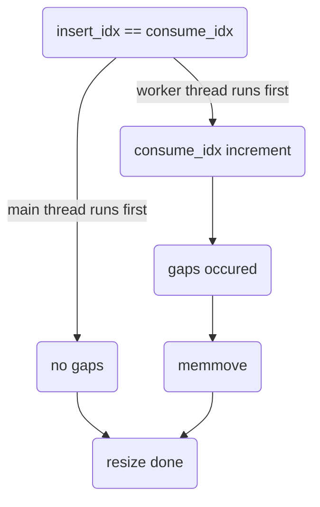

# threadpool_linux

## Overview

`threadpool_linux` is the Linux-specific implementation of the `threadpool` module. It receives an execution engine at creation time in order to executes scheduled asynchronous work items after been created. `threadpool_linux` supports timer functions to execute at a regular interval.

## Design

`threadpool_linux` provides the Linux implementation of `threadpool`. The `threadpool` object starts a predefined number of threads that are used to execute the work items. The `threadpool` unit tracks all the work items which need to be executed in an task array. All incoming tasks are being added in `threadpool_schedule_work` and scheduled in `threadpool_work_func`. 

`threadpool` maintains the following:
1. `sm`: a SM handle to manage the state for `threadpool`.
2. `max_thread_count`, `min_thread_count`, `used_thread_count` : static 32-bit counters for the `threadpool` thread limits.
3. `semaphore` : a semaphore to ensure the number of waiting tasks changed atomically when a task is inserted or consumed in the array.
4. `task_array` : a circular array of waiting tasks with default size 2048, initialized in `threadpool_create`. Insert index and consume index for the array is initialized to 0. Insert index is incremented every time when a new work item add to the array, and the consume index is incremented every time when a task gets executed. The remainder of insert index and array size gives the actual insert position, and the remainder of consume index and array size gives the actual consume position. Each array item contains a `THREADPOOL_TASK` object, which obtains the `task_state` and task function information.
    - `task_state` can be following:
       - `TASK_NOT_USED` : Entry is not used. Entered after a call to `threadpool_create`, new array items after a call to `reallocate_threadpool_array`, and a call to `threadpool_work_func`.
       - `TASK_INITIALIZING` : Start copying work item into the entry. Entered in the progress of a call to `threadpool_schedule_work`.
       - `TASK_WAITING` : Work item in the entry is waiting to be executed. Entered after a call to `threadpool_schedule_work` with a zero return value.
       - `TASK_WORKING` : Work item is executing. Entered in the progress of a call to `threadpool_work_func` by calling `threadpool_open_async`.
5. `task_array_size` : a 32 bit variable represents the size of the task array.
6. `insert_idx` : a 64 bit variable represents the next available insert position in the circular task array.
7. `consume_idx` : a 64 bit variable represents the next available consume position in the circular task array.
8. `srw_lock` : a SRW lock to ensure the progress of resize array will not be interupted as well as task array insert and consume get locked when task array resize happens. 
9. `thread_handle_array` : an array of threads in the `threadpool`, all intialized in `threadpool_open_async`. 

### Reallocating the Task Array

`threadpool` allocates an array for all tasks instead of allocating a context for each work item to reduce the overhead of memory allocation since this module is in the hot path. When the task array is full, the array size shall be doubled to reduce the number of memory allocations. When reallocating the task array, there is overhead due to the memory allocation and copy. But the performance impact would be very infrequent since the size of array is doubled every time. If there is a context switch right after getting the insert index and the consume index is incremented after that, there will be a gap between consume index and insert index during reallocation. In this case, the size of gaps shall be calculated and a memory move shall be performed to remove the gap. New task array memory layout should be in same order of the original array with emilinated gaps between items.  `compress_count` is used to record the number of gaps between `insert_idx` and `consume_idx`. New task array should initialize `consume_idx` as -1 and `insert_idx` as (original array size - gap size - 1) to get the correct index when incremented. If the doubled array size get overflowed for a 32 bits integer, resize failed and return. In this case, the maximum size of task array is 2^32 and the maximum value of `insert_idx` and `consume_idx` is 2^64 which will never get overflowed.



## Exposed API
```C

typedef struct THREADPOOL_TAG* THREADPOOL_HANDLE;
typedef struct TIMER_INSTANCE_TAG* TIMER_INSTANCE_HANDLE;

#define THREADPOOL_OPEN_RESULT_VALUES \
    THREADPOOL_OPEN_OK, \
    THREADPOOL_OPEN_ERROR

MU_DEFINE_ENUM(THREADPOOL_OPEN_RESULT, THREADPOOL_OPEN_RESULT_VALUES)

typedef void (*ON_THREADPOOL_OPEN_COMPLETE)(void* context, THREADPOOL_OPEN_RESULT open_result);
typedef void (*THREADPOOL_WORK_FUNCTION)(void* context);

MOCKABLE_FUNCTION(, THREADPOOL_HANDLE, threadpool_create, EXECUTION_ENGINE_HANDLE, execution_engine);
MOCKABLE_FUNCTION(, void, threadpool_destroy, THREADPOOL_HANDLE, threadpool);

MOCKABLE_FUNCTION(, int, threadpool_open_async, THREADPOOL_HANDLE, threadpool, ON_THREADPOOL_OPEN_COMPLETE, on_open_complete, void*, on_open_complete_context);
MOCKABLE_FUNCTION(, void, threadpool_close, THREADPOOL_HANDLE, threadpool);

MOCKABLE_FUNCTION(, int, threadpool_schedule_work, THREADPOOL_HANDLE, threadpool, THREADPOOL_WORK_FUNCTION, work_function, void*, work_function_context);

MOCKABLE_FUNCTION(, int, threadpool_timer_start, THREADPOOL_HANDLE, threadpool, uint32_t, start_delay_ms, uint32_t, timer_period_ms, THREADPOOL_WORK_FUNCTION, work_function, void*, work_function_context, TIMER_INSTANCE_HANDLE*, timer_handle);

MOCKABLE_FUNCTION(, int, threadpool_timer_restart, TIMER_INSTANCE_HANDLE, timer, uint32_t, start_delay_ms, uint32_t, timer_period_ms);

MOCKABLE_FUNCTION(, void, threadpool_timer_cancel, TIMER_INSTANCE_HANDLE, timer);

MOCKABLE_FUNCTION(, void, threadpool_timer_destroy, TIMER_INSTANCE_HANDLE, timer);

```
###  threadpool_create

```C
MOCKABLE_FUNCTION(, THREADPOOL_HANDLE, threadpool_create, EXECUTION_ENGINE_HANDLE, execution_engine);
```

`threadpool_create` creates a new threadpool.

`threadpool_create` shall allocate memory for a threadpool object and on success return a non-`NULL` handle to it. 

If `execution_engine` is `NULL`, `threadpool_create` shall fail and return `NULL`. 

`threadpool_create` shall create a `SM_HANDLE` by calling `sm_create`.

`threadpool_create` shall initialize thread count parameters by calling `execution_engine_linux_get_parameters` with parameter `execution_engine`. 

`threadpool_create` shall allocate memory for an array of thread objects and on success return a non-`NULL` handle to it.

`threadpool_create` shall allocate memory for an array of tasks and on success return a non-`NULL` handle to it.

`threadpool_create` shall initialize every task item in the tasks array with `task_func` and `task_param` set to `NULL` and `task_state` set to `TASK_NOT_USED`.

`threadpool_create` shall create a SRW lock by calling `srw_lock_create`.

`threadpool_create` shall create a shared semaphore between threads with initialized value zero.

`insert_idx`  and `consume_idx` for the task array shall be intialzied to 0.

If any error occurs, `threadpool_create` shall fail and return `NULL`.

### threadpool_destroy

```C
MOCKABLE_FUNCTION(, void, threadpool_destroy, THREADPOOL_HANDLE, threadpool);
```

`threadpool_destroy` frees the resouces associated with `threadpool`.

If `threadpool` is `NULL`, `threadpool_destroy` shall return.

`threadpool_destroy` shall implicit close if `threadpool` is open. 

`threadpool_destroy` shall free the resources associated with the threadpool handle. 

`threadpool_destroy` shall destroy the semphore by calling `sem_destroy`.

`threadpool_destroy` shall destroy the SRW lock by calling `srw_lock_destroy`.

### threadpool_open_async

```C
MOCKABLE_FUNCTION(, int, threadpool_open_async, THREADPOOL_HANDLE, threadpool, ON_THREADPOOL_OPEN_COMPLETE, on_open_complete, void*, on_open_complete_context);
```

`threadpool_open_async` opens the threadpool asynchronously.

If `threadpool` is `NULL`, `threadpool_open_async` shall fail and return a non-zero value. 

`threadpool_open_async` shall call `sm_open_begin`. 

`threadpool_open_async` shall create the threads for `threadpool` using `ThreadAPI_Create`.

If `threadpool` has already been opened, `threadpool_open_async` shall fail and return a non-zero value.

If one of the thread creation fails, `threadpool_open_async` shall fail and return a non-zero value, terminate all threads already created.

Otherwise, `threadpool_open_async` shall shall call `sm_open_end` with true for success.

`threadpool_open_async` shall succeed and return zero, indicate open success to the user by calling the `on_open_complete` callback with `THREADPOOL_OPEN_OK`.

### threadpool_close

```C
MOCKABLE_FUNCTION(, void, threadpool_close, THREADPOOL_HANDLE, threadpool);
```

`threadpool_close` closes the threadpool.

If `threadpool` is `NULL`, `threadpool_close` shall fail and return.

Otherwise, `threadpool_close` shall join all threads in the `threadpool`.

`threadpool_close` shall call `sm_close_begin`.

`threadpool_close` shall call `sm_close_end`.

### threadpool_schedule_work

```C
MOCKABLE_FUNCTION(, int, threadpool_schedule_work, THREADPOOL_HANDLE, threadpool, THREADPOOL_WORK_FUNCTION, work_function, void*, work_function_context);
```

`threadpool_schedule_work` schedule the threadpool to work.

If `threadpool` is `NULL`, `threadpool_schedule_work` shall fail and return a non-zero value.

If `work_function` is `NULL`, `threadpool_schedule_work` shall fail and return a non-zero value.

`threadpool_schedule_work` shall get the threadpool state by calling `interlocked_add`.

`threadpool_schedule_work` shall call `sm_exec_begin`.

If `sm_exec_begin` returns `SM_EXEC_REFUSED`, `threadpool_schedule_work` shall fail and return a non-zero value.

`threadpool_schedule_work` shall acquire the SRW lock in shared mode by calling `srw_lock_acquire_shared`.

`threadpool_schedule_work` shall increment the `insert_pos`.

If task state is `TASK_NOT_USED`, `threadpool_schedule_work` shall set the current task state to `TASK_INITIALIZING`.

Otherwise, `threadpool_schedule_work` shall release the shared SRW lock by calling `srw_lock_release_shared` and increase `task_array` capacity by calling `reallocate_threadpool_array`.

  - `reallocate_threadpool_array` shall acquire the SRW lock in exclusive mode by calling `srw_lock_acquire_exclusive`.

  - `reallocate_threadpool_array` shall get the current size of task array by calling `interlocked_add`.

  - If there is any overflow computing the new size, `reallocate_threadpool_array` shall fail and return a non-zero value .

  - Otherwise, `reallocate_threadpool_array` shall double the current task array size.

  - `reallocate_threadpool_array` shall realloc the memory used for the array items and on success return a non-`NULL` handle to it.

  - If any error occurs, `reallocate_threadpool_array` shall fail and return a non-zero value.

  - `reallocate_threadpool_array` shall initialize every task item in the new task array with `task_func` and `task_param` set to `NULL` and `task_state` set to `TASK_NOT_USED`.

  - `reallocate_threadpool_array` shall remove any gap in the task array.

  - `reallocate_threadpool_array` shall reset the `consume_idx` and `insert_idx` to 0 after resize the task array.

  - `reallocate_threadpool_array` shall release the SRW lock by calling `srw_lock_release_exclusive`.

  - `reallocate_threadpool_array` shall return zero on success.

If reallocating the task array fails, `threadpool_schedule_work` shall fail and return a non-zero value.

`threadpool_schedule_work` shall obtain task information in next available task array index and return zero on success.

`threadpool_schedule_work` shall set the `task_state` to `TASK_WAITING` and then release the shared SRW lock.

`threadpool_schedule_work` shall unblock the `threadpool` semaphore by calling `sem_post`.

`threadpool_schedule_work` shall decrement the count of pending call that are in progress to be executed.

`threadpool_schedule_work` shall call `sm_exec_end`.

### threadpool_timer_start

```C
MOCKABLE_FUNCTION(, int, threadpool_timer_start, THREADPOOL_HANDLE, threadpool, uint32_t, start_delay_ms, uint32_t, timer_period_ms, THREADPOOL_WORK_FUNCTION, work_function, void*, work_function_ctx, TIMER_INSTANCE_HANDLE*, timer_handle);
```

`threadpool_timer_start` starts a threadpool timer which runs after `start_delay_ms` milliseconds and then runs again every `timer_period_ms` milliseconds until `threadpool_timer_cancel` or `threadpool_timer_destroy` is called. The `timer_handle` must be stopped before closing/destroying the threadpool.

If `threadpool` is `NULL`, `threadpool_timer_start` shall fail and return a non-zero value.  

If `work_function` is `NULL`, `threadpool_timer_start` shall fail and return a non-zero value. 

If `timer_handle` is `NULL`, `threadpool_timer_start` shall fail and return a non-zero value. 

`work_function_ctx` shall be allowed to be `NULL`. 

`threadpool_timer_start` shall allocate a context for the timer being started and store `work_function` and `work_function_ctx` in it. 

`threadpool_timer_start` shall call `timer_create` and `timer_settime` to schedule execution. 

If any error occurs, `threadpool_timer_start` shall fail and return a non-zero value. 

`threadpool_timer_start` shall return and allocated handle in `timer_handle`. 

`threadpool_timer_start` shall succeed and return 0. 

If `timer_settime` fails, `threadpool_timer_start` shall delete the timer by calling `timer_delete`. 

### threadpool_timer_restart

```C
MOCKABLE_FUNCTION(, int, threadpool_timer_restart, TIMER_INSTANCE_HANDLE, timer, uint32_t, start_delay_ms, uint32_t, timer_period_ms);
```

`threadpool_timer_restart` changes the delay and period of an existing timer.

If `timer` is `NULL`, `threadpool_timer_restart` shall fail and return a non-zero value. 

`threadpool_timer_restart` shall call `timer_settime` to changethe delay and period. 

If `timer_settime` fails, `threadpool_timer_restart` shall fail and return a non-zero value. 

`threadpool_timer_restart` shall succeed and return 0. 

### threadpool_timer_cancel

```C
MOCKABLE_FUNCTION(, void, threadpool_timer_cancel, TIMER_INSTANCE_HANDLE, timer);
```

`threadpool_timer_cancel` shall stops the timer. Afterward, the timer may be resumed with a new time by calling `threadpool_timer_restart` or cleaned up by calling `threadpool_timer_destroy`.

If `timer` is `NULL`, `threadpool_timer_cancel` shall fail and return. 

`threadpool_timer_cancel` shall call `timer_settime` with 0 for `flags` and `NULL` for `old_value` and `{0}` for `new_value` to cancel the ongoing timers. 


### threadpool_timer_destroy

```C
MOCKABLE_FUNCTION(, void, threadpool_timer_destroy, TIMER_INSTANCE_HANDLE, timer);
```

`threadpool_timer_destroy` stops the timer started by `threadpool_timer_start` and cleans up its resources.

If `timer` is `NULL`, `threadpool_timer_destroy` shall fail and return. 

`threadpool_timer_cancel` shall call `timer_delete` to destroy the ongoing timers. 

`threadpool_timer_destroy` shall free all resources in `timer`. 

### threadpool_work_func

```C
static int threadpool_work_func(void* param);
```

`threadpool_work_func` shall executes work items for as long as it can acquire work items from the threadpool's task array.

If `param` is `NULL`, `threadpool_work_func` shall fail and return.

`threadpool_work_func` shall get the real time by calling `clock_gettime` to set the waiting time for semaphore.

`threadpool_work_func` shall  shall wait on the semaphore with a time limit.

`threadpool_work_func` shall acquire the shared SRW lock by calling `srw_lock_acquire_shared`.

`threadpool_work_func` shall get the current task array size by calling `interlocked_add`.

`threadpool_work_func` shall increment the current consume index by calling `interlocked_increment_64`.

`threadpool_work_func` shall get the next waiting task consume index by taking the reminder of the incremented consume index and current task array size.

If consume index has task state `TASK_WAITING`, `threadpool_work_func` shall set the task state to `TASK_WORKING`.

`threadpool_work_func` shall copy copy the function and parameter to local variables.

`threadpool_work_func` shall set the task state to `TASK_NOT_USED`.

`threadpool_work_func` shall release the shared SRW lock by calling `srw_lock_release_shared`.

If the work item function is not `NULL`, `threadpool_work_func` shall execute it with `work_function_ctx`.

`threadpool_work_func` shall loop until `threadpool_close` is called.

### reallocate_threadpool_array

```C
static int reallocate_threadpool_array(THREADPOOL* threadpool);
```

`reallocate_threadpool_array` resize the task array size by doubling it.

`reallocate_threadpool_array` shall acquire the SRW lock in exclusive mode by calling `srw_lock_acquire_exclusive`.

`reallocate_threadpool_array` shall get the current size of task array by calling `interlocked_add`.

If there is any overflow computing the new size, `reallocate_threadpool_array` shall fail and return a non-zero value .

Otherwise, `reallocate_threadpool_array` shall double the current task array size.

`reallocate_threadpool_array` shall realloc the memory used for the array items and on success return a non-`NULL` handle to it.

If any error occurs, `reallocate_threadpool_array` shall fail and return a non-zero value.

`reallocate_threadpool_array` shall initialize every task item in the new task array with `task_func` and `task_param` set to `NULL` and `task_state` set to `TASK_NOT_USED`.

`reallocate_threadpool_array` shall remove any gap in the task array.

`reallocate_threadpool_array` shall reset the `consume_idx` and `insert_idx` to -1 after resize the task array.

`reallocate_threadpool_array` shall release the SRW lock by calling `srw_lock_release_exclusive`.

`reallocate_threadpool_array` shall return zero on success.
